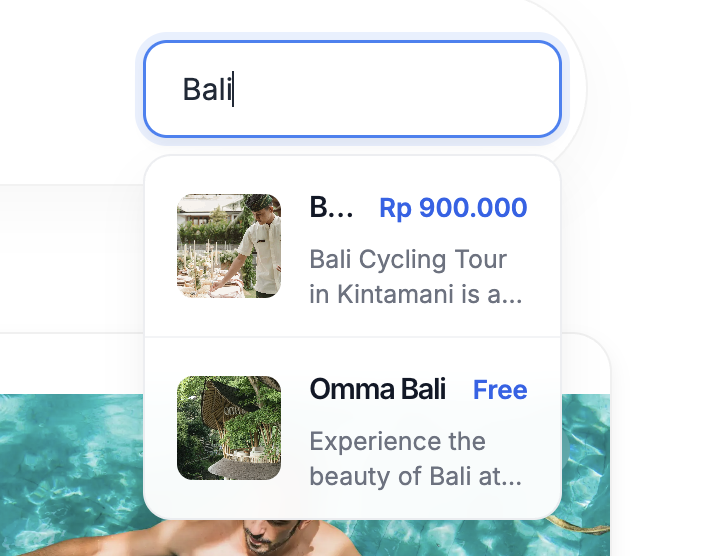

# Modul Live Search

Panduan konfigurasi dan integrasi pencarian interaktif real-time (`livesearch.php` & `sidebar_livesearch.php`) pada tema JWC.

---

## 🛠️ Langkah-Langkah Panduan & Setup

### 1. Register Sidebar pada Config Tema
Buka file `public_html/jwc_theme_config.php` dan daftarkan `Sidebar_Livesearch`:

```php
$data['sidebar'] = array(
    ...
    'Sidebar_Livesearch' => 'sidebar_livesearch',
    ...
);
```

---

### 2. Penempatan File Modul
* Pindahkan file `sidebar_livesearch.php` ke:
  ```
  public_html/theme/front/sidebar/sidebar_livesearch.php
  ```
* Pindahkan file `livesearch.php` ke:
  ```
  public_html/theme/front/sidebar/type/livesearch.php
  ```

---

### 3. Modifikasi File `post.php`
Tambahkan logika kondisional berikut pada `public_html/theme/front/sidebar/type/post.php`:

```php
...
<?php if ($opsi == 'livesearch'): ?>
    <?php include "livesearch.php"; ?>
<?php endif; ?>
...
```

---

### 4. Menambahkan Search Bar Component
Salin dan tempelkan kode yang ada di file [search_component.php](search_component.php) ke lokasi/elemen HTML tempat search bar ingin ditampilkan (misal di header atau navbar).

---

### 5. Pengaturan Sidebar di cPanel / Admin Dashboard
Tambahkan data baru pada menu Sidebar di cPanel/Admin Dashboard dengan judul **Sidebar_Livesearch**.


